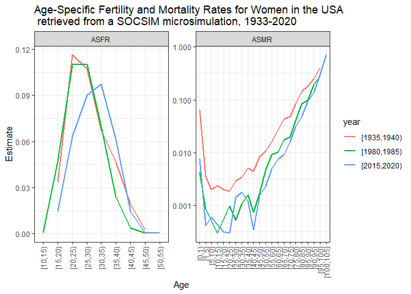

Demographic microsimulations in R using SOCSIM: Modelling population and
kinship dynamics
================
A Member Initiated Meeting at the 2023 Meeting of the Population
Association of America (PAA); New Orleans, Apr 12, 2023

- <a href="#1-setup" id="toc-1-setup">1. Setup</a>
- <a
  href="#2-running-a-simulation-and-retrieving-the-input-demographic-rates"
  id="toc-2-running-a-simulation-and-retrieving-the-input-demographic-rates">2.
  Running a simulation and retrieving the input demographic rates</a>
- <a
  href="#3-what-can-you-do-with-simulation-output-example-estimates-of-bereavement"
  id="toc-3-what-can-you-do-with-simulation-output-example-estimates-of-bereavement">3.
  What can you do with simulation output? Example: estimates of
  bereavement</a>
- <a href="#4-learn-more" id="toc-4-learn-more">4. Learn more</a>
- <a href="#references" id="toc-references">References</a>

## Introduction: What is SOCSIM and how does it work?

Socsim was originally developed for Unix at UC Berkeley (E. Hammel et
al. 1976), where it has been maintained for decades. The current release
of rsocsim aims to be OS-agnostic and, for the most part,
back-compatible with the original Socsim distribution. See
<https://lab.demog.berkeley.edu/socsim/> and especially
<https://lab.demog.berkeley.edu/socsim/CurrentDocs/socsimOversimplified.pdf>.

The following description of SOCSIM was adapted from the Supplementary
Materials of (Alburez‐Gutierrez, Mason, and Zagheni 2021). SOCSIM is an
open source and extensible demographic microsimulation program. It is
written in the C programming language and relies heavily on arrays of
linked lists to keep track of kinship relationships and to store
information about simulated individuals. The simulator takes as input
initial population files and monthly age-specific fertility and
mortality demographic rates. The individual is the unit of analysis of
the simulator. Each person is subject to a set of rates, expressed as
monthly probabilities of events, given certain demographic
characteristics, like age and sex. Every month, each individual faces
the risk of experiencing a number of events, including childbirth,
death, and marriage. The selection of the event and the waiting time
until the event occurs are determined stochastically using a competing
risk model. Some other constraints are included in the simulation
program in order to draw events only for individuals that are eligible
for the events (e.g. to allow for a minimum interval of time between
births from the same mother, to avoid social taboos such as incest,
etc.). Each event for which the individual is at risk is modeled as a
piece-wise exponential distribution. The waiting time until each event
occurs is randomly generated according to the associated demographic
rates. The individual’s next event is the one with the shortest waiting
time. At the end of the simulation, population files that contain a list
of everyone who has ever lived in the population are created. In these
files, each individual is an observation in a rectangular data file with
records of demographic characteristics for the individual, and
identification numbers for key kinship relations. SOCSIM models “closed”
populations. Individuals may enter and exit the simulation only by
(simulated) birth and death.

SOCSIM has been used extensively in social science research to study,
among other things, dynamics of kin availability Verdery and Margolis
(2017), generational overlap Alburez‐Gutierrez, Mason, and Zagheni
(2021), and kin loss Snyder et al. (2022).

# 1. Setup

We recommend that you go through point 1 of this tutorial **before** the
start of the workshop. If you have any questions/difficulties, please
get in touch with the workshop coordinator (Diego Alburez).


## 1.1. Installation

Install the development version of `rsocsim` from GitHub
(<https://github.com/MPIDR/rsocsim>). We may have made changes to the
`rsocsim` package ahead of this workshop. To be on the safe side, if you
had already installed the package, please uninstall it and and install
it again.

``` r
# remove.packages("rsocsim")
# install.packages("devtools")
devtools::install_github("MPIDR/rsocsim")
```

Let’s see if everything is working fine. `rsocsim` has a simple built-in
simulation that you can run to see if the package was installed
correctly. For now, let’s run the code without focusing on the technical
details:

``` r
library(rsocsim)

# create a new folder for all the files related to a simulation.
# this will be in your home- or user-directory:
folder = rsocsim::create_simulation_folder()

# create a new supervisory-file. supervisory-files tell socsim what
# to simulate. create_sup_file will create a very basic supervisory file
# and it copies some rate-files that will also be needed into the 
# simulation folder:
supfile = rsocsim::create_sup_file(folder)

# Choose a random-number seed:
seed = 300

# Start the simulation:
rsocsim::socsim(folder,supfile,seed)
```

    ## [1] "Start run1simulationwithfile"
    ## [1] "/Users/mallikasnyder/socsim/socsim_sim_4232"
    ## [1] "300"
    ## Start socsim
    ## start socsim main. MAXUYEARS: 200; MAXUMONTHS: 2400
    ## ratefile: socsim.sup
    ## 
    ## v18a!-command-line argv[0]: zerothArgument| argv[1]: socsim.sup| argv[2]: 300| argv[3]: 1
    ## random_number seed: 300| command-line argv[1]: socsim.sup| argv[2]: 300
    ## compatibility_mode: 1| command-line argv[3]: 1
    ## Socsim Version: STANDARD-UNENHANCED-VERSION
    ## initialize_segment_vars
    ## initialize_segment_vars done
    ## 18b - loading -.sup-file: socsim.sup
    ## 18b-load.cpp->load . socsim.sup
    ## #load.cpp->load 4. socsim.sup
    ## 18b-load.cpp->load . SWEfert2022
    ## #load.cpp->load 4. SWEfert2022
    ## Incomplete rate set, will add rate till MAXUYEARS (death-->1.0; others:0.0) 12
    ## Incomplete rate set, will add rate till MAXUYEARS (death-->1.0; others:0.0) 12
    ## 18b-load.cpp->load . SWEmort2022
    ## #load.cpp->load 4. SWEmort2022
    ## Incomplete rate set, will add rate till MAXUYEARS (death-->1.0; others:0.0) 12
    ## Incomplete rate set, will add rate till MAXUYEARS (death-->1.0; others:0.0) 12
    ## Incomplete rate set, will add rate till MAXUYEARS (death-->1.0; others:0.0) 12
    ## Incomplete rate set, will add rate till MAXUYEARS (death-->1.0; others:0.0) 12
    ## Incomplete rate set, will add rate till MAXUYEARS (death-->1.0; others:0.0) 12
    ## Incomplete rate set, will add rate till MAXUYEARS (death-->1.0; others:0.0) 12
    ## Incomplete rate set, will add rate till MAXUYEARS (death-->1.0; others:0.0) 12
    ## Incomplete rate set, will add rate till MAXUYEARS (death-->1.0; others:0.0) 12
    ## ------------4marriage_eval == DISTRIBUTION . socsim.sup
    ## ------------6------------7
    ##  output file names:
    ##  init_new.opop|init_new.omar|init_new.opox|sim_results_socsim.sup_300_/result.pyr|sim_results_socsim.sup_300_/result.stat|init_new.otx|
    ## fix pop pointers..
    ## Starting month is 601
    ## Initial size of pop 8000  (living: 8000)
    ## ------------aa3s------------aa32New events generated for all living persons
    ## ------------b1month:  700 PopLive:  9399 Brths:  12 Dths:   0 Mrgs:  4 Dvs:  0 Mq: 3759 Fq:0 ti1: 0.2 ti2: 0.006982 0.4941
    ## month:  800 PopLive: 10826 Brths:  24 Dths:   1 Mrgs:  9 Dvs:  0 Mq: 3811 Fq:0 ti1: 0.4 ti2: 0.007363 0.5070
    ## month:  900 PopLive: 12235 Brths:  19 Dths:   1 Mrgs:  8 Dvs:  0 Mq: 3942 Fq:0 ti1: 0.5 ti2: 0.011034 0.7101
    ## month: 1000 PopLive: 13444 Brths:  15 Dths:   2 Mrgs:  6 Dvs:  0 Mq: 4044 Fq:0 ti1: 0.7 ti2: 0.007067 0.4321
    ## month: 1100 PopLive: 14284 Brths:  13 Dths:   7 Mrgs:  8 Dvs:  0 Mq: 4072 Fq:0 ti1: 0.8 ti2: 0.007183 0.4332
    ## month: 1200 PopLive: 14635 Brths:  16 Dths:  16 Mrgs:  7 Dvs:  0 Mq: 3985 Fq:0 ti1: 1.0 ti2: 0.008143 0.5128
    ## month: 1300 PopLive: 14510 Brths:   7 Dths:  15 Mrgs:  3 Dvs:  0 Mq: 3873 Fq:0 ti1: 1.2 ti2: 0.006207 0.4138
    ## month: 1400 PopLive: 14130 Brths:   8 Dths:  21 Mrgs:  4 Dvs:  0 Mq: 3812 Fq:0 ti1: 1.3 ti2: 0.008038 0.5531
    ## month: 1500 PopLive: 13533 Brths:  10 Dths:  14 Mrgs:  1 Dvs:  0 Mq: 3688 Fq:0 ti1: 1.5 ti2: 0.011165 0.8209
    ## month: 1600 PopLive: 13087 Brths:  10 Dths:  15 Mrgs:  4 Dvs:  0 Mq: 3628 Fq:0 ti1: 1.6 ti2: 0.007096 0.5391
    ## month: 1700 PopLive: 12777 Brths:  18 Dths:  15 Mrgs:  7 Dvs:  0 Mq: 3495 Fq:0 ti1: 1.8 ti2: 0.006721 0.5502
    ## month: 1800 PopLive: 12312 Brths:   5 Dths:  13 Mrgs:  1 Dvs:  0 Mq: 3401 Fq:0 ti1: 1.9 ti2: 0.004863 0.4204
    ## 
    ## 
    ## Socsim Main Done
    ## Socsim Done.
    ## [1] "restore previous working dir: /Users/mallikasnyder/Desktop/rsocsim_workshop_paa"

    ## [1] 1

You should see a long output in the console, at the end of which is the
message “Socsim done”. Ignore the two warning messages (‘can’t open
transition history file. Hope that’s OK’). They are expected.

For more details on the package, the SOCSIM simulator, its history and
applications, see `rsocsim`’s website:
<https://mpidr.github.io/rsocsim/>.

## 1.2. Other packages

Let’s load the packages we will need for this workshop:

``` r
library(rsocsim)
# install.packages("tidyverse")
library(tidyverse) #For data wrangling
# install.packages("ggh4x")
library(ggh4x) #for extended facet plotting
# install.packages("data.table") #for large datasets
library(data.table)
```

# 2. Running a simulation and retrieving the input demographic rates

> Instructor: Liliana P. Calderón-Bernal,
> <https://twitter.com/lp_calderonb>

## 2.1. The simulation: supervisory and rate files

To provide an example of `rsocsim` usage, we will run a SOCSIM
microsimulation for the United States of America (USA) over the period
1933-2020. This microsimulation uses as input: age-specific fertility
rates by calendar year and year of age downloaded from the [Human
Fertility Database (HFD)](https://www.humanfertility.org/), and
age-specific probabilities of death by sex downloaded from the [Human
Mortality Database (HMD)](https://www.mortality.org/). To run the
simulation, the original [HFD](https://www.humanfertility.org/) and
[HMD](https://www.mortality.org/) data must be first converted to
monthly rates/probabilities and SOCSIM format as described in Socsim
Oversimplified (c.f. Mason 2016 for details). The rates corresponding to
each year are specified in the supervisory file `socsim_USA.sup`,
provided in this repository, which will be used to run the simulation.
The first segment of the simulation runs for 100 years (1200 months) to
produce a stable age structure, based on HFD rates and HMD probabilities
for 1933. Each of the following segments runs for one year (12 months)
with the corresponding fertility and mortality files.

## 2.2. Write the input rate files for a SOCSIM simulation for the USA, 1933-2020

The structure of the rate files is essential to run SOCSIM. According to
Socsim Oversimplified (c.f. Mason 2016, 26–28), a rate block is a
complete set of age specific rates governing a demographic event for
people of a particular sex, group and marital status. In the rate files,
the order is always event (birth, death, marriage), group (1, ..), sex
(F or M), and marital status (married, single, divorced, widowed). For
the birth rates, this can be followed by number indicating parity. Each
subsequent line contains a one month rate or probability and the age
interval over which it holds (years and months of the upper age bound).
The interval includes the upper age bound in previous line and ends just
before the upper age bound in current line. The first two numbers are
years and months of the upper age bound, which are added together,
e.g. upper age bound of “1 0” or “0 12” refers to the first year of life
\[0,1).

Let’s load some functions we prepared to write SOCSIM rate files from
HFD and HMD.

``` r
# Load functions to write SOCSIM rate files
source("functions.R")
```

### 2.2.1. Fertility files for SOCSIM

For the input Age-Specific Female Fertility Rates, we keep the whole age
range included in HFD \[12-55\], but limit the open-ended age intervals
12- and 55+ to one year, i.e. \[12-13) and \[55-56). Additionally,
SOCSIM requires a final age category with an upper bound corresponding
to the maximum length of life, that we fixed to \[56-110\], to be
consistent with HMD data.

To convert the HFD annual fertility rates to ‘SOCSIM’ monthly fertility
rates, we assume that they are constant over the year and divide them by
12 months. The are identical for all marital status, but are specified
for single and married women in the rate files. Other marital status
(divorced, widowed, cohabiting) follow SOCSIM’s rate default rules.

To write the input fertility files, please download from the [HFD
website](https://www.humanfertility.org/), the Period Age-specific
fertility rates all birth orders combined, by calendar year and age for
the desired country (asfrRR), in our case the U.S.A. Please save it as a
.txt file called USAasfrRR.txt in the same project folder. If you have
problems downloading the data, you can use the file USAasfrRR provided
in this repository.

The function below converts HFD data to SOCSIM format following the
procedure explained above. To run it, type the name of the country as
used in HFD (here, “USA”).

``` r
write_socsim_rates_HFD(Country = "USA") 
```

### 2.2.2. Mortality files for SOCSIM

For the input Age-Specific Probabilities of Death, we keep the whole age
range included in HMD \[0-110+\] but limit the open-ended age interval
110+ to one year, i.e. \[110-111). Originally, SOCSIM had an upper bound
of 100 years, but in `rsocsim` the maximum age has been extended to 200
years.

We use the probabilities of death (qx) by sex from from
[HMD](https://www.mortality.org/) period life tables, that had been
already smoothed for ages 80 and older, at which observed death rates
M(x) display considerable random variation (For details, see the HMD
Methods Protocol Wilmoth et al. 2021, 34–36).

To convert the annual HMD probabilities to monthly ‘SOCSIM’
probabilities, we assume that the probability of dying is constant over
the year and use the formula
^{1/n}")
proposed by Kenneth Watcher (Kenneth W. Wachter 2014, 53). For the
open-ended age interval 110+, monthly probabilities are equal to 1/12.
The probabilities of death are identical for all marital status of each
sex, and are only specified for single women and single men in the rate
files. Other marital status will follow SOCSIM’s rate default rules.

To write the input mortality files, please download from the [HMD
website](https://www.mortality.org/), the period life tables 1x1 (Age
interval × Year interval) for females and males for the desired country,
in our case the U.S.A. Please save them as a .txt files called
ltfper_1x1.txt and ltmper_1x1.txt in the same project folder. If you
have problems downloading the data, you can use the files provided in
this repository.

The function below converts HMD data to SOCSIM format following the
procedure explained above. To run it, type the name of the country as
used in HMD (here, “USA”).

``` r
write_socsim_rates_HMD(Country = "USA")
```

## 2.3. Create initial population and marriage files

Now that we have the rate files, let’s create the initial population
(.opop) and marriage (.opop) files. The initial .opop will have a size
of 20000, with randomly assigned sex and dates of birth, and group 1 for
all. Other columns will be completed during the simulation. The initial
.omar will be an empty file.

``` r
# Set size of initial population
size_opop <-  20000

# Create data.frame with 14 columns and nrows = size_opop
presim.opop <- setNames(data.frame(matrix(data = 0, ncol = 14, nrow = size_opop)), 
                        c("pid","fem","group","nev","dob","mom","pop",
                          "nesibm","nesibp","lborn","marid","mstat","dod","fmult"))

# Add pid 1:sizeopop
presim.opop$pid <- 1:size_opop

# Add sex randomly
presim.opop$fem <- sample(0:1, nrow(presim.opop), replace = T)

# Add group 1 for all individuals
presim.opop$group <- 1

# Add random dates of birth (max age around 50)
presim.opop$dob <- sample(600:1200, nrow(presim.opop), replace = T)

# Write initial population for pre-simulation (without fertility multiplier)
write.table(presim.opop, "presim.opop", row.names = F, col.names = F)


## Create an empty data frame for presim.omar
presim.omar <- data.frame()

# Write empty omar for pre-simulation
write.table(presim.omar, "presim.omar", row.names = F, col.names = F)
```

## 2.4. Run a SOCSIM simulation using the `rsocsim` package

Now that we have created the input rate files and the initial population
and marriage files, we can run the simulation. To use the `socsim`
function, we need to specify the folder where the supervisory and the
rate files are, the name of the supervisory file for the rates retrieved
from HFD and HMD (1933-2020), and a seed number for the simulation.

``` r
# Specify the folder where the supervisory and the rate files are. 
# If the R session is running through the project, you can use the following command. 
folder <- getwd()

# Type the name of the supervisory file  stored in the above folder:
supfile <- "socsim_USA.sup"

# Choose a seed number (today's date) for the simulation:
seed <- "120423"

# Run a single SOCSIM-simulation with a given folder and the provided supervisory file
# using the "future" process method
rsocsim::socsim(folder, supfile, seed, process_method = "future")
```

The simulation results are ready. We can use the `read_opop` and
`read_omar` functions from the `rsocsim` package to import the output
population and marriage files into `R`.

``` r
## Read the opop file using the read_opop function
opop <- rsocsim::read_opop(folder = getwd(), supfile = "socsim_USA.sup", 
                           seed = "120423", suffix = "",  fn = NULL)
```

    ## [1] "read population file: /Users/mallikasnyder/Desktop/rsocsim_workshop_paa/sim_results_socsim_USA.sup_120423_/result.opop"

``` r
## Read the omar file using the read_opop function
omar <- rsocsim::read_omar(folder = getwd(), supfile = "socsim_USA.sup", 
                           seed = "120423", suffix = "",  fn = NULL)
```

    ## [1] "read marriage file: /Users/mallikasnyder/Desktop/rsocsim_workshop_paa/sim_results_socsim_USA.sup_120423_/result.omar"

Let’s have a glimpse on the simulated population and marriage files.

The population file (.opop) contains one record for each individual who
was ever alive during the simulation. Each record (row) provides the
following information for a given individual: person id (pid), sex (fem,
1 for female and 0 for male), group identifier (group), next scheduled
event (nev), date of birth (dob), person id of mother (mom), person id
of father (pop), person id of next eldest sibling through mother
(nesibm), person id of next eldest sibling through father (nesibp),
person id of last born child (lborn), id of most recent marriage in
.omar file (marid), marital status at end of simulation (mstat), date of
death (dod, or 0 if alive at end of simulation) and fertility multiplier
(fmult).

``` r
head(opop)
```

    ##   pid fem group nev  dob mom pop nesibm nesibp lborn marid mstat  dod    fmult
    ## 1   1   1     1  65 1014   0   0      0      0 27743   444     3 1869 1.767931
    ## 2   2   0     1  65  695   0   0      0      0     0     0     1 1687 0.000000
    ## 3   3   1     1  65 1049   0   0      0      0 28577  2553     4 1929 0.706973
    ## 4   4   1     1  65  732   0   0      0      0     0     0     1 1713 1.581888
    ## 5   5   1     1  65 1165   0   0      0      0 31080  5675     3 2091 1.629917
    ## 6   6   1     1  65  725   0   0      0      0     0     0     1 1610 2.031059

The marriage file (.omar) contains one record for each marriage. Each
marriage record provides the following information: marriage id number
(mid), wife’s person id (wpid), husband’s person id (hpid), date
marriage began (dstart), date marriage ended (dend, it’s 0 if in force
at the end of simulation), reason marriage ended (rend), marriage id of
wife’s next most recent prior marriage (wprior), marriage id of
husband’s next most recent prior marriage (hprior).

``` r
head(omar)
```

    ##   mid  wpid  hpid dstart dend rend wprior hprior
    ## 1   1  6168 16272   1201 1996    3      0      0
    ## 2   2 18801  4054   1201 1642    3      0      0
    ## 3   3 10997  9266   1201 1461    3      0      0
    ## 4   4 17859  4607   1201 1533    3      0      0
    ## 5   5  5490   522   1201 1772    3      0      0
    ## 6   6  1693  1802   1201 1373    3      0      0

## 2.5. Estimate age-specific rates from the SOCSIM microsimulation

To check the accuracy of our microsimulation for the USA, we can
estimate and compare input and output age-specific fertility and
mortality rates (ASFR and ASMR) by sex. For this purpose, we can use the
`estimate_fertility_rates` and `estimate_mortality_rates` functions from
the package. Please note that these calculate age-specific rates for
both fertility and mortality, as they use mid-year population size by
sex and age as an estimate of person-years lived during the year. Hence,
the population in the denominator includes all those who were born
before the
 of
July of a given year and die in or after July of that year or are still
alive at the end of the simulation. Due to the limited population size
in a microsimulation (especially, of survivors at old ages), sometimes
few or no individuals of a specific age are alive at a exact point in
time (here, 1st July). Hence, it is possible to obtain rates higher than
1, equal to 0 (0 Events/Population), infinite (Events/0 Population) and
NaN (0 Events/0 Population) values with these functions.  
To run them, we need to define some arguments: the .opop file `opop`,
final year of the simulation `final_sim_year`, the minimum and maximum
years for which we want to estimate the rates, \[`year_min` and
`year_max`), the size of the year group `year_group`, the minimum and
maximum age for fertility \[`age_min_fert` and `age_max_fert`) or the
maximum age for mortality `age_max_mort`) and the size of the age group
`age_group`. We can compute the rates by different year and age groups
(e.g., 1, 5, or 10), but please check that the minimum and maximum years
and ages correspond to the groups size. Let’s run the code.

``` r
# Estimate age-specific fertility rates
asfr_sim <- rsocsim::estimate_fertility_rates(opop = opop,
                                             final_sim_year = 2020, #[Jan-Dec]
                                             year_min = 1935, # Closed [
                                             year_max = 2020, # Open )
                                             year_group = 5, 
                                             age_min_fert = 10, # Closed [
                                             age_max_fert = 55, # Open )
                                             age_group = 5) #[,)

# Estimate age-specific mortality rates
asmr_sim <- rsocsim::estimate_mortality_rates(opop = opop, 
                                             final_sim_year = 2020, # [Jan-Dec]
                                             year_min = 1935, # Closed
                                             year_max = 2020, # Open )
                                             year_group = 5,
                                             age_max_mort = 110, # Open )
                                             age_group = 5) #[,)
```

We can now plot our SOCSIM-derived estimates of ASFR and ASMR for women
in some selected years.

``` r
# Choose years to plot (in intervals).
yrs_plot <- c("[1935,1940)", "[1980,1985)", "[2015,2020)") 

# Get the age levels to define them before plotting and avoid wrong order
age_levels <- levels(asmr_sim$age)

bind_rows(asfr_sim %>%
            mutate(rate = "ASFR",                   
                   sex = "female"),
          asmr_sim %>% 
            mutate(rate = "ASMR") %>% 
            filter(sex == "female")) %>% 
  mutate(age = factor(as.character(age), levels = age_levels)) %>% 
  # Filter rates of 0, infinite (N_Deaths/0_Pop) and NaN (0_Deaths/0_Pop) values
  filter(socsim !=0 & !is.infinite(socsim) & !is.nan(socsim)) %>% 
  filter(year %in% yrs_plot) %>% 
  ggplot(aes(x = age, y = socsim, group = year, colour = year)) +
  geom_line(linewidth = 1) +
  facet_wrap(. ~ rate, scales = "free") + 
  facetted_pos_scales(y = list(ASFR = scale_y_continuous(),
                               ASMR =  scale_y_continuous(trans = "log10"))) +
  theme_bw() +
  scale_x_discrete(guide = guide_axis(angle = 90)) +
  labs(title = "Age-Specific Fertility and Mortality Rates for Women in the USA \n retrieved from a SOCSIM microsimulation, 1933-2020",
       x = "Age", y = "Estimate")
```



## 2.6. Compare age-specific rates SOCSIM vs HFD/HMD

As an additional check, we can compare the age-specific fertility and
mortality rates retrieved from the SOCSIM output with the original HFD
and HMD data used as input for our microsimulation. Since our estimates
of fertility and mortality rates from SOCSIM output are grouped by
5-year age groups and 5-year calendar periods in the previous example,
we should first estimate the aggregated measures (5x5) from the original
HFD and HMD data. For plotting the data together, we also need some data
wrangling.

Let’s start with fertility estimates.

``` r
# Extract year and age breaks used in the estimate_fertility_rates() to apply the same values to HFD data
# Year breaks. Extract all the unique numbers from the intervals. 
year_breaks_fert <- unique(as.numeric(str_extract_all(asfr_sim$year, "\\d+", simplify = T)))

# Year range to filter HFD data
year_range_fert <- min(year_breaks_fert):max(year_breaks_fert-1)

# Age breaks of fertility rates. Extract all the unique numbers from the intervals 
age_breaks_fert <- unique(as.numeric(str_extract_all(asfr_sim$age, "\\d+", simplify = T)))

# Read the same HFD file used to write the input fertility files
HFD <- read.table(file = "Input/USAasfrRR.txt", 
                  as.is=T, header=T, skip=2, stringsAsFactors=F)

# Wrangle data and compute monthly fertility rates
HFD <- HFD %>% 
  mutate(Age = case_when(Age == "12-" ~ "12",
                         Age == "55+" ~ "55", 
                         TRUE ~ Age),
         Age = as.numeric(Age)) %>% 
  filter(Year %in% year_range_fert) %>% 
  mutate(year = cut(Year, breaks = year_breaks_fert, 
                    include.lowest = F, right = F, ordered_results = T),
         age = cut(Age, breaks = age_breaks_fert, 
                   include.lowest = F, right = F, ordered_results = T)) %>% 
  filter(!is.na(age)) %>% 
  group_by(year, age) %>%
  summarise(ASFR = mean(ASFR)) %>%
  ungroup() %>%
  mutate(Source = "HFD", 
         Rate = "ASFR")

# Wrangle SOCSIM data
SocsimF <- asfr_sim %>% 
  rename(ASFR = socsim) %>% 
  mutate(Source = "SOCSIM",
         Rate = "ASFR")
```

Then, the mortality estimates. Here, we compare the SOCSIM mid-year ASMR
with central death rates from HMD life tables.

``` r
# Extract year and age breaks used in the estimate_mortality_rates() to apply the same values to HMD data
# Year breaks. Extract all the unique numbers from the intervals 
year_breaks_mort <- unique(as.numeric(str_extract_all(asmr_sim$year, "\\d+", simplify = T)))

# Year range to filter HMD data
year_range_mort <- min(year_breaks_mort):max(year_breaks_mort-1)

# Age breaks of mortality rates. Extract all the unique numbers from the intervals 
age_breaks_mort <- unique(as.numeric(str_extract_all(asmr_sim$age, "\\d+", simplify = T)))


# Read the same HMD female life table 1x1 file used to write the input mortality files
ltf <- read.table(file="Input/fltper_1x1.txt",
                  as.is=T, header=T, skip=2, stringsAsFactors=F)

# Read the same HMD male life table 1x1 file used to write the input mortality files
ltm <- read.table(file="Input/mltper_1x1.txt",
                  as.is=T, header=T, skip=2, stringsAsFactors=F)

# Wrangle HMD life tables
HMD <- ltf %>%
  select(Year, Age, mx) %>%
  mutate(Sex = "Female") %>% 
  bind_rows(ltm %>% 
              select(Year, Age, mx) %>%  
              mutate(Sex = "Male")) %>% 
  mutate(Age = ifelse(Age == "110+", "110", Age),
         Age = as.numeric(Age)) %>% 
  filter(Year %in% year_range_mort) %>% 
  mutate(year = cut(Year, breaks = year_breaks_mort, 
                    include.lowest = F, right = F, ordered_results = T),
         age = cut(Age, breaks = age_breaks_mort, 
                   include.lowest = F, right = F, ordered_results = T)) %>%
  filter(!is.na(age)) %>% 
  group_by(year, Sex, age) %>% 
  summarise(mx = mean(mx)) %>%
  ungroup() %>% 
    mutate(Source = "HMD",
           Rate = "ASMR")

# Wrangle SOCSIM data
SocsimM <- asmr_sim %>% 
  rename(mx = socsim) %>% 
  mutate(Sex = ifelse(sex == "male", "Male", "Female"),
         Source = "SOCSIM",
         Rate = "ASMR") %>% 
  select(year, Sex, age,  mx, Source, Rate)
```

Finally, we can plot together the age-specific fertility and mortality
rates (ASFR and ASMR) from SOCSIM vs HFD and HMD for women in the USA.

``` r
## Plotting ASFR and ASMR (for females) from HFD/HMD vs SOCSIM 
bind_rows(HFD %>% rename(Estimate = ASFR), 
          SocsimF %>% rename(Estimate = ASFR)) %>% 
  mutate(Sex = "Female") %>%   
  bind_rows(HMD %>% rename(Estimate = mx),
            SocsimM %>% rename(Estimate = mx)) %>% 
  # Filter rates of 0, infinite (N_Deaths/0_Pop) and NaN (0_Deaths/0_Pop) values
  filter(Estimate != 0 & !is.infinite(Estimate) & !is.nan(Estimate)) %>% 
  filter(Sex == "Female") %>% 
  mutate(age = factor(as.character(age), levels = age_levels)) %>%
  filter(year %in% yrs_plot) %>% 
  ggplot(aes(x = age, y = Estimate, group = interaction(year, Source)))+
  facet_wrap(. ~ Rate, scales = "free") + 
  geom_line(aes(colour = year, linetype = Source), linewidth = 1)+
  scale_linetype_manual(values = c("HFD" = "solid", "HMD" = "solid","SOCSIM" = "11")) +
  facetted_pos_scales(y = list(ASFR = scale_y_continuous(),
                               ASMR =  scale_y_continuous(trans = "log10")))+
  scale_x_discrete(guide = guide_axis(angle = 90)) +
  labs(title = "Age-Specific Fertility and Mortality rates in the USA (1933-2020) \n retrieved from HFD, HMD and a SOCSIM simulation", 
       x = "Age") + 
  theme_bw()
```


# 3. What can you do with simulation output? Example: estimates of bereavement

> Instructor: Mallika Snyder, <https://twitter.com/mallika_snyder>

After running our simulation code, SOCSIM provides us with a synthetic
genealogy for the entire population. We know when people are born, when
they die, when they marry, and who their parents and spouse are. What
can we do with this information?

One advantage of using a tool like SOCSIM is that we can identify
extended kin networks, especially for more distant kin that would be
hard to link together using a census or a household survey. For example,
how straightforward would it be to find an individual’s
great-grandmother in a household survey, assuming odds of co-residence
are not high? Of course, some kinds of kin are easier to identify than
others, based on the information we have in SOCSIM (and some may be
impossible to find). When identifying kin, we use lateral kin
relationships—such as parents and children–or affinal kin
relationships—such as spouses. This is the principle behind the
retrieve_kin function included in this package, which can be used to
identify kin from a variety of kin relationships (parents, grandparents,
spouses, children, and much more). You can read the full documentation
for this function by typing in \`\`?retrieve_kin’’ into your RStudio
console.

In addition to enabling us to more easily identify networks, SOCSIM also
provides us with valuable information about the timing of vital events,
like births, deaths, and marriages, in these networks. This can help us
connect changes in the vital rates that go into SOCSIM to changes in the
networks that our simulated people have available to them, often at a
very fine temporal level (months or years). In this workshop, we will
focus on just one very simple example–parental bereavement–but there are
many more possible ways to use SOCSIM to study these and other questions
about kinship dynamics.

In previous research, SOCSIM has been especially helpful for studying
kin loss in connection with mortality change Snyder et al. (2022). Here
we will focus on a simple example, changes in the rate of experiencing
the loss of a relative over time. We will define as our reference group
women aged 25-39 and alive in a given year: thus, the sample frame will
change in each year. Note that the denominator is all women, not just
those with a relative alive.

In our code, we will approach this by writing a function that we will
loop over each year of interest. The function will take in a year, look
for the individuals of the relevant age who are alive that year,
identify the years of death of their kin, and then calculate the
proportion of our sample who experienced a loss. The code is a
simplified version of functions used in a previous research paper
(Snyder et al. 2022).

### 3.1. Getting our estimates

The first thing we require is a helper function to identify the year of
interest.

``` r
#We won't discuss how this function works, but it uses the final simulation year (January-December)
#and the last simulated month to convert our monthly dates into yearly ones
asYr <- function(month, last_month=last_month, final_sim_year=final_sim_year) {
  return(final_sim_year - trunc((last_month - month)/12))
}
```

Now we can load the data and define a few relevant parameters.

``` r
## Read the opop file using the read_opop function
opop <- rsocsim::read_opop(folder = getwd(), supfile = "socsim_USA.sup", 
                           seed = "120423", suffix = "",  fn = NULL)
```

    ## [1] "read population file: /Users/mallikasnyder/Desktop/rsocsim_workshop_paa/sim_results_socsim_USA.sup_120423_/result.opop"

``` r
#We won't use the omar today, but you can use it when investigating affinal kin
```

``` r
#Parameters specific to this simulation: will need to be changed
last_month <- max(opop$dob) # Last simulated month
final_sim_year <- 2020
```

``` r
#Cleaning our population file
opop <- opop %>% 
 #Fixing dates of death for individuals still living at the end
  mutate(dod = if_else(dod == 0, last_month, dod)) %>%
  #Dates of birth and death in years for both individual and parents
  mutate(dob_year = asYr(dob, last_month=last_month, final_sim_year=final_sim_year),
         dod_year = asYr(dod, last_month=last_month, final_sim_year=final_sim_year))
```

Now that we’ve generated the variables we want, let’s create a simple
function that we can loop through.

``` r
#Estimate annual kin loss for women aged 25-39 in a particular year
getKinLoss <- function(year_of_interest, 
                       opop = opop, omar = omar){
pid_data <- opop %>%
  #Remove those not alive in the year of interest
  filter(data.table::between(lower = dob_year, upper = dod_year, 
                             year_of_interest, incbounds = FALSE),
  #Filter to women
         fem == 1) %>%
  #Find the age of individuals alive
  mutate(age = year_of_interest - dob_year) %>%
  #Filter to women aged 25-39
  filter(data.table::between(lower = 25, upper = 39, age, 
                             incbounds = FALSE))
#Find vector of person IDs
pid_vec <- pid_data$pid

#Use the built-in retrieve_kin function
#We will not identify extended kin relationships (extra_kintypes)
#Or separate kin by sex, but both can be estimated
kin <- rsocsim::retrieve_kin(opop = opop, omar = omar, pid = pid_vec, 
             extra_kintypes = NULL, kin_by_sex = FALSE)

#From retrieve_kin, we get a list of lists named after the type of kin
#We loop over all types of kin included
temp <- bind_rows(lapply(1:length(kin), function(x) {
#Find IDs of kin
kin2 <- unlist(kin[[x]], use.names = FALSE)
#Attach associated person IDs
names(kin2) <- rep(pid_vec, unlist(lapply(kin[[x]], length)))
#Now find the years of death of kin
attr(kin2, "kin.dod.year") <- opop$dod_year[match(kin2, opop$pid)]
#And use that to find which kin have died in this year
attr(kin2, "kin.death.year_of_interest") <- 
  if_else(attr(kin2, "kin.dod.year") %in% year_of_interest, TRUE, FALSE)

#Find the number of individuals who have lost a relative
pid.losekin <- length(unique(names(kin2[attr(kin2, "kin.death.year_of_interest") 
                                        == TRUE])))
#Find the total number of individuals
pid.total <- length(pid_vec)

#Generate output as a tibble
output <- tibble(kintype = names(kin[x]),
                 year = year_of_interest,
                 n_total = pid.total,
                 n_losekin = pid.losekin,
                 pc_losekin = 100*(n_losekin/n_total))
return(output)
}))
}
```

Now loop through this function to generate a tibble with our data for
each year. To limit the time this code will take to run, we’ll look
estimate kin loss at 5-year intervals between 1950 and 2010.

``` r
#Loop through and bind rows
full_data <- bind_rows(lapply(seq.int(from = 1950, to = 2010, 
                                      by = 5), 
                              function(x) getKinLoss(year_of_interest = x, 
                                                      opop = opop, 
                                                     omar = omar)))
```

### 3.2. Examining our estimates

``` r
#Plot this data by year
full_data %>%
  #Clean names of kin
  mutate(kintype = if_else(kintype == "ggparents", "Great-grandparents", 
                           if_else(kintype == "gparents", "Grandparents", 
                                   if_else(kintype == "gchildren", "Grandchildren",
                                           kintype))),
         kintype = str_to_title(kintype)) %>%
  #Create plot
  ggplot(aes(x = year, y = pc_losekin, color = kintype)) + 
  geom_line() +
  labs(x = "Year", y = "% of women aged 25-39 who lose a relative", 
       color = "Type of kin lost") +
  #Fix the axes
  scale_x_continuous(expand = c(0,0)) + 
  scale_y_continuous(expand = c(0,0)) +
  #Set a theme
  theme_bw() 
```


These results show us how rates of parental loss have changed for women
over time: as we would expect for this age group, the highest rates of
kin loss would be for grandparents and parents. The increasing rate of
grandparental loss over time, along with a similar trend for
great-grandparents, could relate to increasing life expectancies during
this period: as grandparents live to older ages, the chance that this
loss would be experienced even earlier diminishes.

**To discuss:** How do you think you could extend this analysis to look
at other kin? What are you interested in learning about, and how do you
think SOCSIM could help you in your work?

# 4. Learn more

The ‘SOCSIM Oversimplified’ manual written by Carl Mason is a great
starting point to learn more about how SOCSIM works:
<https://lab.demog.berkeley.edu/socsim/CurrentDocs/socsimOversimplified.pdf>.

You can find more information about the `rsocsim` in the package’s
website: <https://mpidr.github.io/rsocsim/>, including documentation for
the functions currently available and work in progress.

We are working on preparing extended vignettes with exercises and
examples for using `rsocsim`. Follow us on twitter for updates!

- Tom Theile: <https://twitter.com/TheileTom>
- Diego Alburez: <https://twitter.com/d_alburez>
- Liliana P. Calderón-Bernal, <https://twitter.com/lp_calderonb>
- Mallika Snyder: <https://twitter.com/mallika_snyder>

# References

<div id="refs" class="references csl-bib-body hanging-indent">

<div id="ref-alburezgutierrez_sandwich_2021" class="csl-entry">

Alburez‐Gutierrez, Diego, Carl Mason, and Emilio Zagheni. 2021. “The
‘Sandwich Generation’ Revisited: Global Demographic Drivers of Care Time
Demands.” *Population and Development Review* 47 (4): 997–1023.
<https://doi.org/10.1111/padr.12436>.

</div>

<div id="ref-hammel_demographic_2005" class="csl-entry">

Hammel, E. A. 2005. “Demographic Dynamics and Kinship in Anthropological
Populations.” *Proceedings of the National Academy of Sciences* 102 (6):
2248–53. <https://doi.org/10.1073/pnas.0409762102>.

</div>

<div id="ref-hammel_socsim_1976" class="csl-entry">

Hammel, E., D Hutchinson, K Wachter, R Lundy, and R Deuel. 1976. *The
SOCSIM Demographic-Sociological Microsimulation Program: Operating
Manual*. Institute of International Studies. University of California
Berkeley.

</div>

<div id="ref-HMD" class="csl-entry">

HMD. Human Mortality Database. n.d. “<span class="nocase">Max Planck
Institute for Demographic Research (Germany)</span> and <span
class="nocase">University of California, Berkeley (USA)</span> and <span
class="nocase">French Institute for Demographic Studies (France)</span>
<span class="nocase">Available at www.mortality.org</span>.”

</div>

<div id="ref-HFD" class="csl-entry">

Human Fertility Database. n.d. “<span class="nocase">Max Planck
Institute for Demographic Research (Germany)</span> and <span
class="nocase">Vienna Institute of Demography (Austria)</span> <span
class="nocase">Available at www.humanfertility.org</span>.”

</div>

<div id="ref-margolis_cohort_2019" class="csl-entry">

Margolis, Rachel, and Ashton M. Verdery. 2019. “A Cohort Perspective on
the Demography of Grandparenthood: Past, Present, and Future Changes in
Race and Sex Disparities in the United States.” *Demography* 56 (4):
1495–1518. <https://doi.org/10.1007/s13524-019-00795-1>.

</div>

<div id="ref-mason2016socsim" class="csl-entry">

Mason, Carl. 2016. “Socsim Oversimplified. Berkeley: Demography Lab,
University of California.”

</div>

<div id="ref-snyder_estimates_2022" class="csl-entry">

Snyder, Mallika, Diego Alburez-Gutierrez, Iván Williams, and Emilio
Zagheni. 2022. “Estimates from 31 Countries Show the Significant Impact
of COVID-19 Excess Mortality on the Incidence of Family Bereavement.”
*Proceedings of the National Academy of Sciences* 119 (26): e2202686119.
<https://doi.org/10.1073/pnas.2202686119>.

</div>

<div id="ref-verdery_projections_2017" class="csl-entry">

Verdery, Ashton M., and Rachel Margolis. 2017. “Projections of White and
Black Older Adults Without Living Kin in the United States, 2015 to
2060.” *Proceedings of the National Academy of Sciences* 114 (42):
11109–14. <https://doi.org/10.1073/pnas.1710341114>.

</div>

<div id="ref-verdery_tracking_2020" class="csl-entry">

Verdery, Ashton M., Emily Smith-Greenaway, Rachel Margolis, and Jonathan
Daw. 2020. “Tracking the Reach of COVID-19 Kin Loss with a Bereavement
Multiplier Applied to the United States.” *Proceedings of the National
Academy of Sciences* 117 (30): 17695.
<https://doi.org/10.1073/pnas.2007476117>.

</div>

<div id="ref-wachter2014essential" class="csl-entry">

Wachter, Kenneth W. 2014. *Essential Demographic Methods*. Harvard
University Press.

</div>

<div id="ref-wachter_kinship_1997" class="csl-entry">

Wachter, Kenneth W. 1997. “Kinship Resources for the Elderly.”
*Philosophical Transactions of the Royal Society of London. Series B:
Biological Sciences* 352 (1363): 1811–17.
<https://doi.org/10.1098/rstb.1997.0166>.

</div>

<div id="ref-wilmoth_methods_2021" class="csl-entry">

Wilmoth, J, K Andreev, D Jdanov, D. A. Glei, T Riffe, C Boe, M
Bubenheim, et al. 2021. “Methods Protocol for the Human Mortality
Database.” University of California, Berkeley; Max Planck Institute for
Demographic Research, Rostock. <https://www.mortality.org/>.

</div>

<div id="ref-zagheni_impact_2011" class="csl-entry">

Zagheni, Emilio. 2011. “The Impact of the HIV/AIDS Epidemic on Kinship
Resources for Orphans in Zimbabwe.” *Population and Development Review*
37 (4): 761–83. <https://doi.org/10.1111/j.1728-4457.2011.00456.x>.

</div>

</div>
