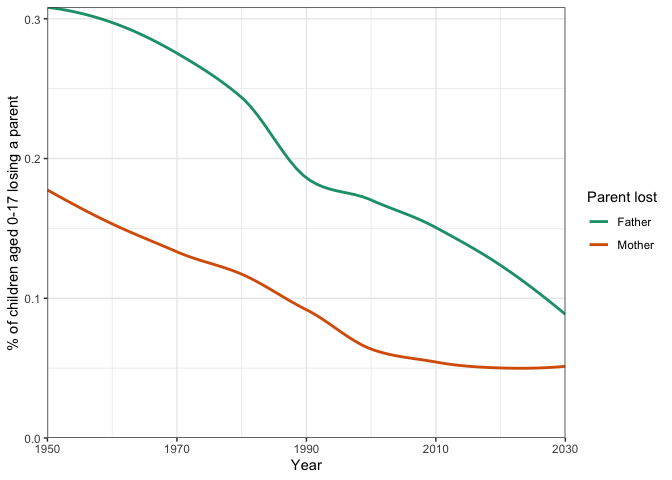

PAA Workshop: Estimating Bereavement
================

After running our simulation code, SOCSIM provides us with a synthetic
genealogy for the entire population. We know when people are born, when
they die, when they marry, and who their parents and spouse are. What
can we do with this information?

One advantage of using a tool like SOCSIM is that we can identify
extended kin networks, especially for more distant kin that would be
hard to link together using a census or a household survey. For example,
how straightforward would it be to find an individual’s
great-grandmother in a household survey, assuming odds of co-residence
are not high? Of course, some kinds of kin are easier to identify than
others, based on the information we have in SOCSIM (and some may be
impossible to find). When identifying kin, we use lateral kin
relationships—such as parents and children–or affinal kin
relationships—such as spouses. This is the principle behind the
retrieve_kin function included in this package: since this function can
take a while to run, we won’t discuss it in this workshop, but you are
welcome to look more carefully at the source code and think about
extensions you could write to make it more useful to your work.

In addition to enabling us to more easily identify networks, SOCSIM also
provides us with valuable information about the timing of vital events,
like births, deaths, and marriages, in these networks. This can help us
connect changes in the vital rates that go into SOCSIM to changes in the
networks that our simulated people have available to them, often at a
very fine temporal level (months or years). In this workshop, we will
focus on just one very simple example–parental bereavement–but there are
many more possible ways to use SOCSIM to study these and other questions
about kinship dynamics.

In previous research, SOCSIM has been especially helpful for studying
kin loss in connection with mortality change (include citations). Here
we will focus on a simple example, changes in the probability of
experiencing the loss of a parent over time. We will define as our
reference group children aged 0-17 and alive in a given year: thus, the
sample frame will change in each year.

In our code, we will approach this by writing a function that we will
loop over each year of interest. The function will take in a year, look
for the individuals of the relevant age who are alive that year,
identify the years of death of their parents, and then calculate the
proportion of our sample who experienced a loss.

### Getting our estimates

``` r
#Load dependencies
require(tidyverse) #For data wrangling
require(RColorBrewer) #For nicer colors
```

The first thing we require is a helper function to identify the year of
interest.

``` r
#We won't discuss how this function works, but it uses the ending simulation year
#and month to convert our monthly dates into yearly ones
asYr <- function(FinalSimYear = FinalSimYear, endmo = endmo, x) {
  return(trunc(FinalSimYear - (endmo - x)/12))
}
```

Now we can load the data and define a few relevant parameters.

``` r
load("Test_data/sims.Rsave") #Load the data
#Pulling out relevant SOCSIM output
opop <- sims$opop #population file
#We won't use the omar today, but you can use it when investigating affinal kin
```

``` r
#Parameters specific to this simulation: will need to be changed
endmo <- max(opop$dob) + 1 #Ending month of simulation
FinalSimYear <- 2035
```

``` r
#Cleaning our population file
opop <- opop %>% 
 #Fixing dates of death for individuals still living at the end
  mutate(dod = if_else(dod == 0, endmo, dod)) %>%
  #Dates of birth and death in years for both individual and parents
  mutate(dob_year = asYr(endmo = endmo, FinalSimYear = FinalSimYear, dob),
         dod_year = asYr(endmo = endmo, FinalSimYear = FinalSimYear, dod), 
         mom_dod_year = dod_year[match(mom, pid)],
         pop_dod_year = dod_year[match(pop, pid)])
```

Now that we’ve generated the variables we want, let’s create a simple
function that we can loop through.

``` r
#Find sample population: children aged 0-17 in 2020
getKinLoss <- function(year_of_interest, opop = opop){
data <- opop %>%
  #Remove those not alive in the year of interest
  filter(data.table::between(lower = dob_year, upper = dod_year, 
                             year_of_interest, incbounds = FALSE)) %>%
  #Find the age of individuals alive
  mutate(age = year_of_interest - dob_year) %>%
  filter(age <= 17) %>%
  #Find individuals who experienced a parental death
  mutate(mom_death = (mom_dod_year == year_of_interest),
         pop_death = (pop_dod_year == year_of_interest)) %>%
  #Find proportions
  summarize(mom_loss = 100*mean(mom_death),
            pop_loss = 100*mean(pop_death)) %>%
  mutate(year = year_of_interest)
return(data)
}
```

Now loop through this function to generate a tibble with our data for
each year.

``` r
#Loop through and bind rows
full_data <- bind_rows(lapply(1950:2030, 
                              function(x) getKinLoss(year_of_interest = x, 
                                                      opop = opop)))
```

### Examining our estimates

``` r
#Plot this data as a smoothed trendline
full_data %>%
  #Pivot the data to long format
  pivot_longer(cols = c(mom_loss, pop_loss), 
               names_to = "type",
               values_to = "pc_loss") %>%
  mutate(type = if_else(type == "mom_loss", "Mother", "Father")) %>%
  ggplot(aes(x = year, y = pc_loss, color = type)) + 
  geom_smooth(formula = y ~ x, method = "loess", se = FALSE) +
  labs(x = "Year", y = "% of children aged 0-17 losing a parent", 
       color = "Parent lost") +
  #Fix the axes
  scale_x_continuous(expand = c(0,0)) + 
  scale_y_continuous(limits = c(0, NA), expand = c(0,0)) +
  #Set a theme
  theme_bw() +
  scale_color_brewer(palette = "Dark2")
```

<!-- -->

These results show us how rates of parental loss have changed for
children over time: as we would expect, they have decreased with
declining mortality. Since fathers are expected to be older than
mothers, based on SOCSIM’s marriage matching model of age differences
between spouses, we would expect higher mortality for them, and higher
rates of bereavement for their children as a result.

**To discuss:** How do you think you could extend this analysis to look
at other kin? What are you interested in learning about, and how do you
think SOCSIM could help you in your work?
